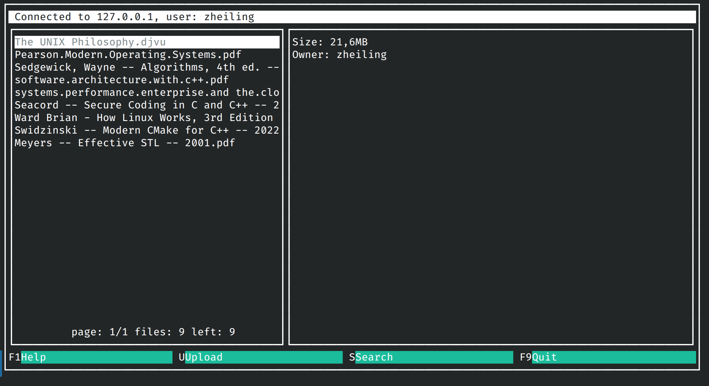

# Bulletin Board System (Client Side)
This is my sandbox project. I made it test and develop my programming skills. Maybe one day it become a mature and production-ready project.

## Setup
1. Create necessary file structure by running `$ ./setup.sh`.
It will create all necessary file structure in order to run the program correctly. 

2. Build the binary running `$ make` or `$ make bbs-client`
3. Run it by `$ make run`

## Development
### Widget development
In order to switch to widget/screen development, configure cmake with `-DDEV_WIDGET=ON`

### Name conventions:

For objective elements like UI, there is a following name convention:

`b_element_action`, where:
* `b` stands for which block does the function belongs to;
* `element` - the element name;
* `action` - an action performed with the element;

There are 3 type of blocks available yet:
* `w`: widget
* `m`: modal
* `u`: utility